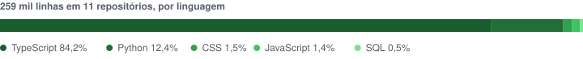
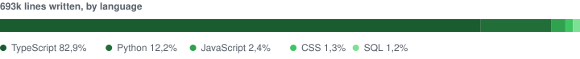

## Ted Fernandes &nbsp;  

Desenho as duas pontas. Interface que se explica sozinha, segurança como requisito e não como ajuste no fim.

<picture>
  <source media="(prefers-color-scheme: dark)" srcset="charts/linguagens-dark.svg">
  
</picture>

### Stack

| | |
|---|---|
| **IA no produto** |   |
| **Front-end** |      |
| **Back-end** |      |
| **Dados** |    |
| **Ambiente e ferramentas** |      |

É só chamar por aqui.

<code>&nbsp;EN&nbsp;</code>&nbsp; read in English

 

## Ted Fernandes &nbsp;  

I design both ends. Interfaces that explain themselves, security as a requirement rather than an afterthought.

<picture>
  <source media="(prefers-color-scheme: dark)" srcset="charts/linguagens-en-dark.svg">
  
</picture>

### Stack

| | |
|---|---|
| **AI in the product** |   |
| **Front-end** |      |
| **Back-end** |      |
| **Data** |    |
| **Environment & tooling** |      |

Just reach out here.

