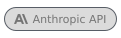

## Ted Fernandes &nbsp;  

Desenho as duas pontas. Interface que se explica sozinha, segurança como requisito e não como ajuste no fim.

### Stack

<table>
<tr>
  <td><strong>Camada de IA</strong></td>
  <td><picture><source media="(max-width: 500px)" srcset="badges/anthropic-api-m.svg"></picture> <picture><source media="(max-width: 500px)" srcset="badges/gemini-m.svg"></picture> <picture><source media="(max-width: 500px)" srcset="badges/groq-m.svg"></picture> <picture><source media="(max-width: 500px)" srcset="badges/whisper-m.svg"></picture> <picture><source media="(max-width: 500px)" srcset="badges/ai-sdk-m.svg"></picture></td>
</tr>
<tr>
  <td><strong>Front-end</strong></td>
  <td><picture><source media="(max-width: 500px)" srcset="badges/nextjs-m.svg"></picture> <picture><source media="(max-width: 500px)" srcset="badges/react-m.svg"></picture> <picture><source media="(max-width: 500px)" srcset="badges/typescript-m.svg"></picture> <picture><source media="(max-width: 500px)" srcset="badges/tailwind-m.svg"></picture> <picture><source media="(max-width: 500px)" srcset="badges/shadcn-ui-m.svg"></picture></td>
</tr>
<tr>
  <td><strong>Back-end</strong></td>
  <td><picture><source media="(max-width: 500px)" srcset="badges/nodejs-m.svg"></picture> <picture><source media="(max-width: 500px)" srcset="badges/python-m.svg"></picture> <picture><source media="(max-width: 500px)" srcset="badges/fastapi-m.svg"></picture> <picture><source media="(max-width: 500px)" srcset="badges/authjs-m.svg"></picture> <picture><source media="(max-width: 500px)" srcset="badges/zod-m.svg"></picture></td>
</tr>
<tr>
  <td><strong>Dados e infra</strong></td>
  <td><picture><source media="(max-width: 500px)" srcset="badges/postgresql-m.svg"></picture> <picture><source media="(max-width: 500px)" srcset="badges/neon-m.svg"></picture> <picture><source media="(max-width: 500px)" srcset="badges/redis-m.svg"></picture> <picture><source media="(max-width: 500px)" srcset="badges/docker-m.svg"></picture></td>
</tr>
<tr>
  <td><strong>Ambiente</strong></td>
  <td><picture><source media="(max-width: 500px)" srcset="badges/github-m.svg"></picture> <picture><source media="(max-width: 500px)" srcset="badges/cloudflare-m.svg"></picture> <picture><source media="(max-width: 500px)" srcset="badges/vercel-m.svg"></picture></td>
</tr>
<tr>
  <td><strong>Ferramentas</strong></td>
  <td><picture><source media="(max-width: 500px)" srcset="badges/claude-code-m.svg"></picture> <picture><source media="(max-width: 500px)" srcset="badges/vitest-m.svg"></picture> <picture><source media="(max-width: 500px)" srcset="badges/playwright-m.svg"></picture></td>
</tr>
</table>

É só chamar por aqui.

<code>&nbsp;EN&nbsp;</code>&nbsp; read in English

 

## Ted Fernandes &nbsp;  

I design both ends. Interfaces that explain themselves, security as a requirement rather than an afterthought.

### Stack

<table>
<tr>
  <td><strong>AI layer</strong></td>
  <td><picture><source media="(max-width: 500px)" srcset="badges/anthropic-api-m.svg"></picture> <picture><source media="(max-width: 500px)" srcset="badges/gemini-m.svg"></picture> <picture><source media="(max-width: 500px)" srcset="badges/groq-m.svg"></picture> <picture><source media="(max-width: 500px)" srcset="badges/whisper-m.svg"></picture> <picture><source media="(max-width: 500px)" srcset="badges/ai-sdk-m.svg"></picture></td>
</tr>
<tr>
  <td><strong>Front-end</strong></td>
  <td><picture><source media="(max-width: 500px)" srcset="badges/nextjs-m.svg"></picture> <picture><source media="(max-width: 500px)" srcset="badges/react-m.svg"></picture> <picture><source media="(max-width: 500px)" srcset="badges/typescript-m.svg"></picture> <picture><source media="(max-width: 500px)" srcset="badges/tailwind-m.svg"></picture> <picture><source media="(max-width: 500px)" srcset="badges/shadcn-ui-m.svg"></picture></td>
</tr>
<tr>
  <td><strong>Back-end</strong></td>
  <td><picture><source media="(max-width: 500px)" srcset="badges/nodejs-m.svg"></picture> <picture><source media="(max-width: 500px)" srcset="badges/python-m.svg"></picture> <picture><source media="(max-width: 500px)" srcset="badges/fastapi-m.svg"></picture> <picture><source media="(max-width: 500px)" srcset="badges/authjs-m.svg"></picture> <picture><source media="(max-width: 500px)" srcset="badges/zod-m.svg"></picture></td>
</tr>
<tr>
  <td><strong>Data &amp; infra</strong></td>
  <td><picture><source media="(max-width: 500px)" srcset="badges/postgresql-m.svg"></picture> <picture><source media="(max-width: 500px)" srcset="badges/neon-m.svg"></picture> <picture><source media="(max-width: 500px)" srcset="badges/redis-m.svg"></picture> <picture><source media="(max-width: 500px)" srcset="badges/docker-m.svg"></picture></td>
</tr>
<tr>
  <td><strong>Environment</strong></td>
  <td><picture><source media="(max-width: 500px)" srcset="badges/github-m.svg"></picture> <picture><source media="(max-width: 500px)" srcset="badges/cloudflare-m.svg"></picture> <picture><source media="(max-width: 500px)" srcset="badges/vercel-m.svg"></picture></td>
</tr>
<tr>
  <td><strong>Tooling</strong></td>
  <td><picture><source media="(max-width: 500px)" srcset="badges/claude-code-m.svg"></picture> <picture><source media="(max-width: 500px)" srcset="badges/vitest-m.svg"></picture> <picture><source media="(max-width: 500px)" srcset="badges/playwright-m.svg"></picture></td>
</tr>
</table>

Just reach out here.

